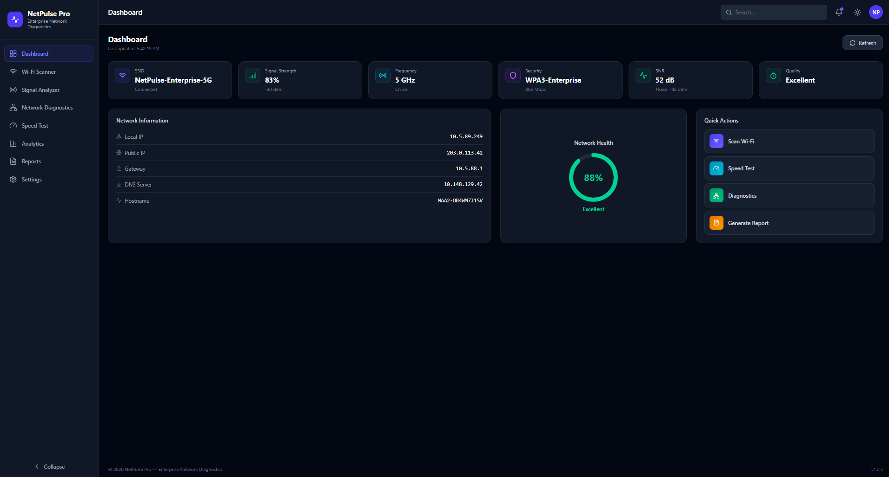
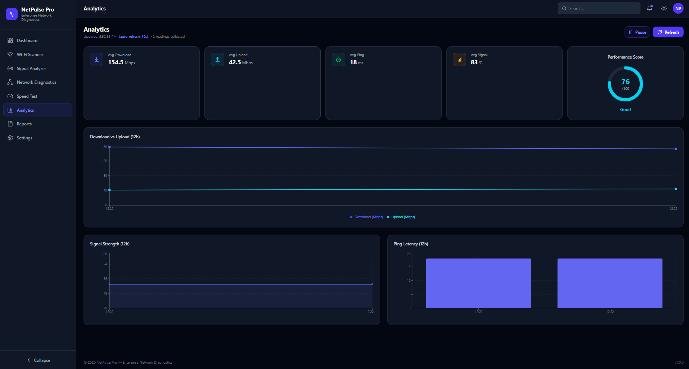
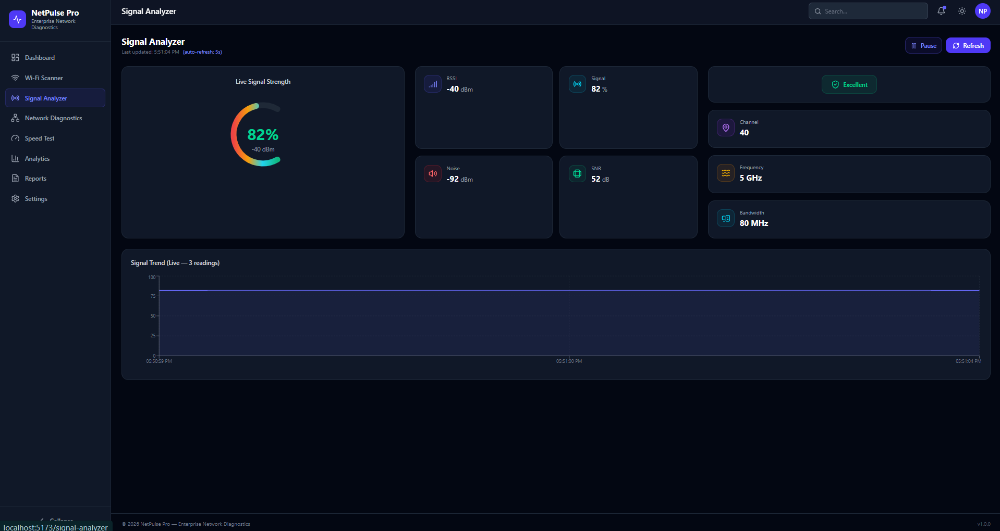
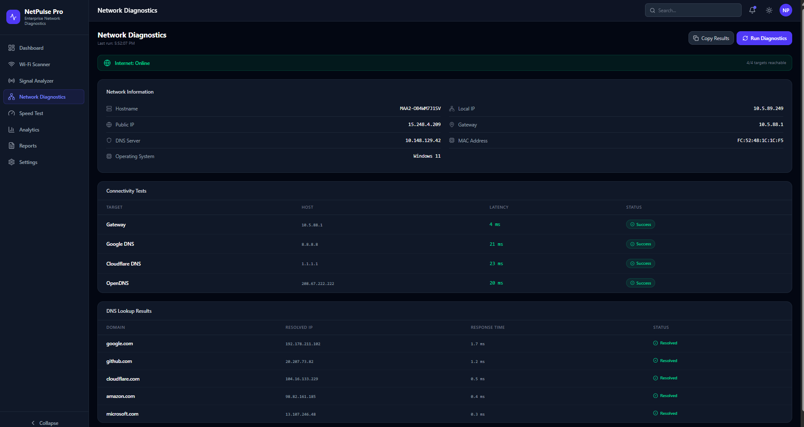
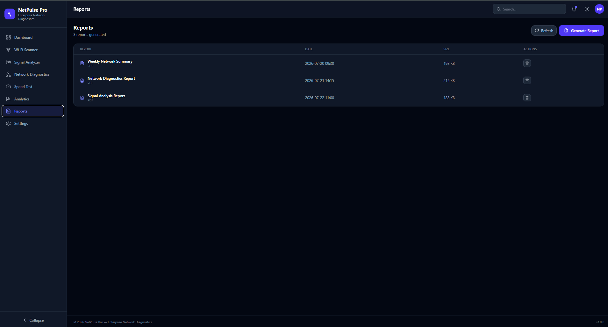

# 📶 NetPulse Pro

<div align="center">



### Enterprise WiFi Network Analyzer & Diagnostics Platform

Monitor • Analyze • Diagnose • Optimize


</div>

---

# 🚀 Overview

NetPulse Pro is an enterprise-grade WiFi monitoring and diagnostics platform built for network engineers, IT administrators and enterprise environments.

It provides real-time WiFi analysis, network diagnostics, signal monitoring, speed testing, analytics and reporting through a modern dashboard.

---

# ✨ Features

## 📊 Dashboard

- Real-time Network Status
- Connected Devices
- Signal Health
- Bandwidth Usage
- Performance Widgets

---

## 📡 WiFi Scanner

- Scan Nearby Networks
- Channel Analysis
- Security Type
- Frequency Band
- RSSI
- BSSID

---

## 📈 Signal Analyzer

- Signal Strength
- Quality Meter
- Historical Trend
- Live Updates

---

## 🌐 Network Diagnostics

- Ping
- DNS Lookup
- Gateway Detection
- Latency
- Packet Loss

---

## ⚡ Speed Test

- Download Speed
- Upload Speed
- Ping
- Jitter

---

## 📊 Analytics

- Historical Reports
- Signal Trends
- Speed History
- Performance Charts

---

## 📄 Reports

- Export PDF
- Export CSV
- Printable Reports

---

## ⚙ Settings

- Application Settings
- Theme
- Refresh Interval

---

# 📷 Screenshots

## Dashboard


---

## Analytics



---

## Signal Analyzer



---

## Network Diagnostics



---

## Reports



---

# 🛠 Tech Stack

Frontend

- React
- Vite
- Tailwind CSS
- Axios
- Recharts

Backend

- Flask
- Python
- SQLite

---

# 📂 Folder Structure

frontend/

backend/

docs/

Screenshots/

README.md

---

# 🚀 Installation

```bash
git clone https://github.com/sivaprakashtech/WiFi-Analyzer-Pro.git

cd WiFi-Analyzer-Pro
```

Frontend

```bash
cd frontend

npm install

npm run dev
```

Backend

```bash
cd backend

pip install -r requirements.txt

python app.py
```

---

# 👨‍💻 Author

Siva Prakash

Amazon Network Validation Engineer
