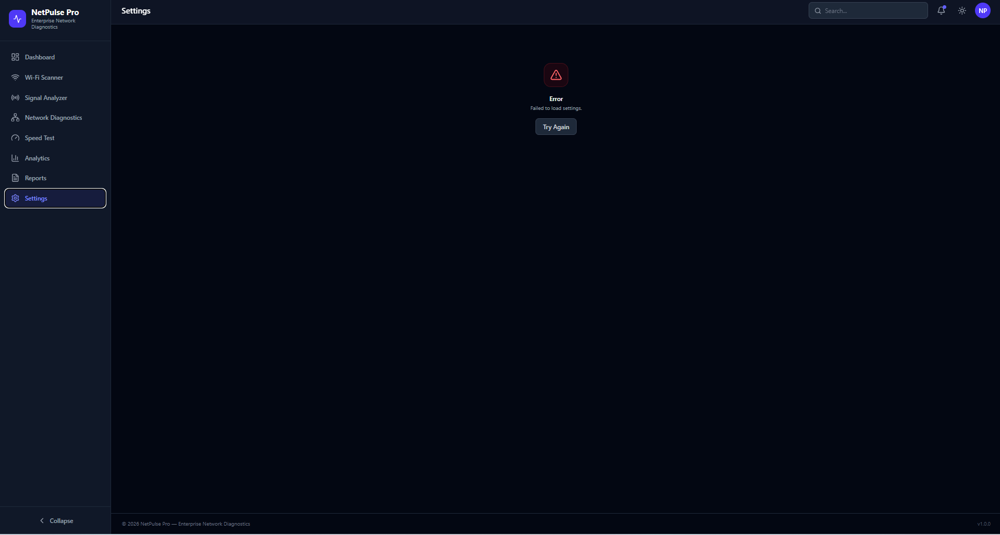

<div align="center">

# 📶 NetPulse Pro

### Enterprise WiFi Network Analyzer & Diagnostics Platform

<p align="center">

Monitor • Analyze • Diagnose • Optimize

</p>

<p align="center">


</p>

<p align="center">


</p>

---

## 🌟 Enterprise Dashboard Preview


---

# 🚀 About NetPulse Pro

NetPulse Pro is a modern Enterprise WiFi Network Monitoring & Diagnostics Platform built for IT Administrators, Network Engineers and Enterprise Infrastructure Teams.

The application provides powerful network visibility through real-time monitoring, signal analytics, WiFi scanning, diagnostics, reporting and performance dashboards.

Designed with an enterprise-grade user experience inspired by Cisco Meraki, Ubiquiti, Microsoft Azure and Aruba Central.

---

# ✨ Core Modules

| Module | Status |
|---------|--------|
| 📊 Dashboard | ✅ |
| 📶 WiFi Scanner | ✅ |
| 📈 Signal Analyzer | ✅ |
| 🌐 Network Diagnostics | ✅ |
| ⚡ Speed Test | ✅ |
| 📉 Analytics | ✅ |
| 📄 Reports | ✅ |
| ⚙ Settings | ✅ |

---

# 📸 Application Preview

## 📊 Dashboard


---

## 📈 Analytics


---

## 📶 Signal Analyzer


---

## 🌐 Network Diagnostics


---

## 📄 Reports


---

## ⚙ Settings



---

# 🏗 System Architecture

```text
                    Browser

                       │

                       ▼

              React + Vite Frontend

                       │

                 Axios REST Client

                       │

                       ▼

                 Flask REST API

                       │

                       ▼

                  SQLite Database
```

---

# 🚀 Features

### 📡 WiFi Analysis

- Scan Nearby Networks
- RSSI Monitoring
- Channel Analysis
- Security Type Detection
- Frequency Monitoring

---

### 📊 Enterprise Dashboard

- Live KPIs
- Network Health
- Performance Widgets
- Real-Time Status

---

### 📈 Analytics

- Signal Trend Charts
- Speed Analysis
- Historical Performance
- Interactive Reports

---

### 🌐 Diagnostics

- Ping Test
- DNS Lookup
- Gateway Information
- Latency Monitoring

---

### ⚡ Speed Testing

- Download Speed
- Upload Speed
- Ping
- Jitter

---

### 📄 Reporting

- Performance Reports
- Historical Records
- Export Support

---

# 🛠 Technology Stack

## Frontend

- React 19
- Vite
- Tailwind CSS
- Axios
- React Router
- Recharts

---

## Backend

- Flask
- Python
- Flask SQLAlchemy
- REST API

---

## Database

- SQLite

---

# 📁 Folder Structure

```text
NetPulse-Pro/

├── frontend/

│ ├── components/

│ ├── layouts/

│ ├── pages/

│ └── services/

│

├── backend/

│ ├── blueprints/

│ ├── models/

│ ├── services/

│ └── app.py

│

├── docs/

├── Screenshots/

└── README.md
```

---

# 📈 Project Statistics

| Category | Count |
|-----------|------:|
| Pages | 8 |
| Components | 30+ |
| REST APIs | 15+ |
| Charts | 8 |
| Modules | 8 |
| Responsive | ✅ |

---

# 🚀 Installation

### Clone Repository

```bash
git clone https://github.com/sivaprakashtech/WiFi-Analyzer-Pro.git
```

### Frontend

```bash
cd frontend

npm install

npm run dev
```

### Backend

```bash
cd backend

python -m venv venv

venv\Scripts\activate

pip install -r requirements.txt

python app.py
```

---

# 🗺 Roadmap

- ✅ Dashboard
- ✅ WiFi Scanner
- ✅ Analytics
- ✅ Diagnostics
- ✅ Reports
- ✅ Settings
- ⬜ Docker
- ⬜ Cloud Deployment
- ⬜ AI Network Analysis

---

# 💡 Future Improvements

- AI Assisted Diagnostics
- Docker Support
- Mobile Application
- Real-Time Alerts
- Multi User Authentication
- Cloud Sync

---

# 📜 License

MIT License

---

# 👨‍💻 Developer

## **Siva Prakash**

**Network Validation Engineer @ Amazon**

Enterprise Web Applications • React • Flask • Python • WiFi Technologies • Network Diagnostics

---

<div align="center">

## ⭐ If you found this project useful, please consider giving it a Star.

Made with ❤️ by **Siva Prakash**

</div># 📶 NetPulse Pro

<div align="center">


### Enterprise WiFi Network Analyzer & Diagnostics Platform

Monitor • Analyze • Diagnose • Optimize


</div>

---

# 🚀 Overview

NetPulse Pro is an enterprise-grade WiFi monitoring and diagnostics platform built for network engineers, IT administrators and enterprise environments.

It provides real-time WiFi analysis, network diagnostics, signal monitoring, speed testing, analytics and reporting through a modern dashboard.

---

# ✨ Features

## 📊 Dashboard

- Real-time Network Status
- Connected Devices
- Signal Health
- Bandwidth Usage
- Performance Widgets

---

## 📡 WiFi Scanner

- Scan Nearby Networks
- Channel Analysis
- Security Type
- Frequency Band
- RSSI
- BSSID

---

## 📈 Signal Analyzer

- Signal Strength
- Quality Meter
- Historical Trend
- Live Updates

---

## 🌐 Network Diagnostics

- Ping
- DNS Lookup
- Gateway Detection
- Latency
- Packet Loss

---

## ⚡ Speed Test

- Download Speed
- Upload Speed
- Ping
- Jitter

---

## 📊 Analytics

- Historical Reports
- Signal Trends
- Speed History
- Performance Charts

---

## 📄 Reports

- Export PDF
- Export CSV
- Printable Reports

---

## ⚙ Settings

- Application Settings
- Theme
- Refresh Interval

---

# 📷 Screenshots

## Dashboard


---

## Analytics


---

## Signal Analyzer


---

## Network Diagnostics


---

## Reports


---

# 🛠 Tech Stack

Frontend

- React
- Vite
- Tailwind CSS
- Axios
- Recharts

Backend

- Flask
- Python
- SQLite

---

# 📂 Folder Structure

frontend/

backend/

docs/

Screenshots/

README.md

---

# 🚀 Installation

```bash
git clone https://github.com/sivaprakashtech/WiFi-Analyzer-Pro.git

cd WiFi-Analyzer-Pro
```

Frontend

```bash
cd frontend

npm install

npm run dev
```

Backend

```bash
cd backend

pip install -r requirements.txt

python app.py
```

---

# 👨‍💻 Author

Siva Prakash

Amazon Network Validation Engineer
